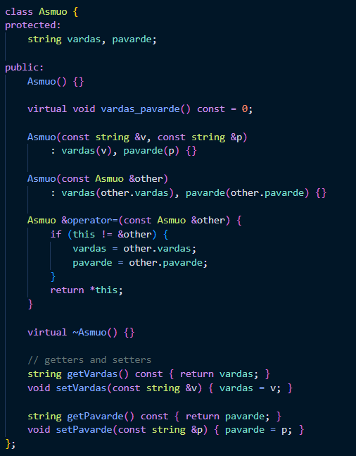
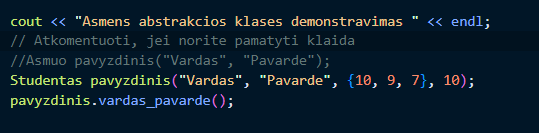
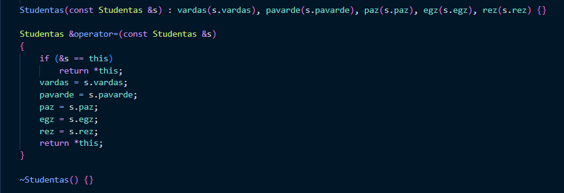
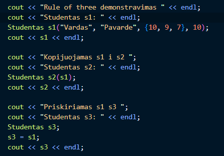
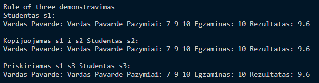
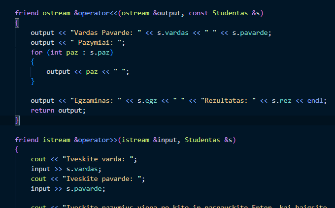
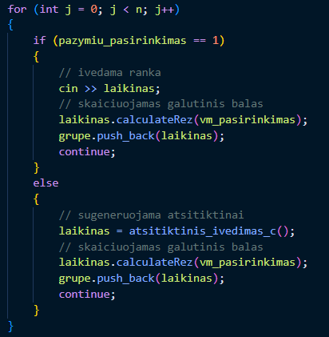
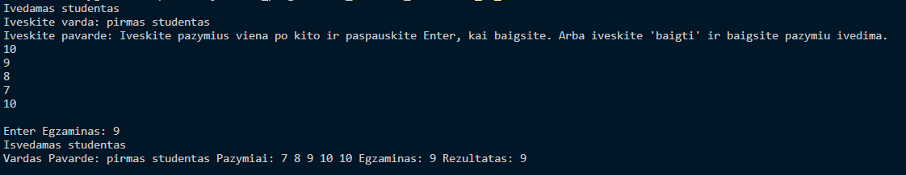

# objektinio_programavimo_uzduotis_v2

## Aprašymas
- Šioje programoje atliekama tas pats, kaip ir 1.0 versijos programoje, tačiau funkcionalumas realizuotas ne su struktūromis, o su **_klasėmis_**. Kode paliktos funkcijos tik su vektoriaus konteineriu. Buvo ištrinti visi failai su list funkcijomis, todėl pasikeitė programos CMakeLists.txt.
- Ši programa sukuria ir apdoroja studentų sąrašus, suskirstydama juos į dvi kategorijas pagal galutinius įvertinimus. Pagrindinės užduotys yra atsitiktinių mokinių duomenų failų generavimas, mokinių rūšiavimas pagal kategoriją, mokinių rūšiavimas į dvi grupes pagal galutinį rezultatą 4 metodais/strategijom ir jų išvedimas į naujus failus. Šių užduočių atlikimas bus matuojamas ir analizuojamas naudojant skirtingo dydžio failus. Pridėtas CMakeLists.txt --> CMake funkcionalumas.
- 1.2 versijoje taip pat realizuota "Rule of three" bei įvesties/išvesties operatoriai sukurtai studento klasei. Šio funkcionalumo demonstravimui sukurtas naujas failas `rule_of_three.cpp`.
- 1.5 versijoje realizuota abstrakti klasė `Asmuo`. `Stundentas` klasė yra išvestinė (angl. derived) `Asmuo` yra bazinė.
- 2.0 versijoje pridėta Doxygen dokumentacija. Jai sukurtas html aplankas ir įkeltas į repoziciją.
- 2.0 versijoje taip pat pridėtas pavyzdinis unittest testas. Jis yra sukurtas naujai pridėtai medianos funkcijai.

## Kaip naudotis

### Jei norite pasirinkti kiek ir ką testuoti paleiskite main.cpp:
- Per terminalą `g++ main.cpp vector.cpp funkcijos.cpp ivestis.cpp -o main` ir `./main`

### Jei norite paleisti greičio matavimo failą laiko_matavimas.cpp:
- Per terminalą: `g++ laiko_matavimas.cpp funkcijos.cpp ivestis.cpp -o laiko_matavimas` ir `./laiko_matavimas`

## 1.5 versijos realizacija:

- Abstrakcios klases `Asmuo` realizacija

- Abstrakcios klases `Asmuo` objektu kurimo klaidos demonstravimas `rule_of_three.cpp` faile

## 1.2 versijos realizuoti metodai:

- "Rule of three" implementavimas

- "Rule of three" demonstravimas

- Įvesties/išvesties operatoriai

- Įvesties operatoriaus panaudojimas rankinio ivedimo metu

- Įvesties/išvesties operatorių demonstravimas

## Greičio testai su skirtingais kompiliatoriaus optimizavimo lygio nustatymais:
### Naudojant klasę ir _O1 flag_:
|                                      |   1000000 s   |   10000000 s   |
| ------------------------------------ |:-------------:|:--------------:|
| Vidutinis failo nuskaitymo laikas    |   3.419 s     |   31.05 s      |
| Vidutinis duomenu rusiavimo laikas   |   0.8665 s    |   10.267 s     |
| Vidutinis duomenu padalijimas i dvi grupes laikas (1 strategija) | 0.1955 s | 2.496 s |
| Vidutinis duomenu padalijimas i dvi grupes laikas (2 strategija) | 0.789 s  | 9.691 s |
| Vidutinis duomenu padalijimas i dvi grupes laikas (3 strategija) | 0.0855 s | 1.144 s |
| Vidutinis duomenu padalijimas i dvi grupes laikas (4 strategija) | 0.1505 s | 3.186 s |
| Vidutinis galvociu irasymo i faila laikas | 6.913 s     | 54.018 s       |
| Vidutinis nuskriaustuku irasymo i faila laikas | 9.626 s  | 78.109 s       |
| **Vidutinis bendras laikas**          | **20.8245 s** | **173.444 s**  |

### Naudojant struktūrą ir _O1 flag_:
|                                      |   1000000 s   |   10000000 s   |
| ------------------------------------ |:-------------:|:--------------:|
| Vidutinis failo nuskaitymo laikas    |   2.6705 s    |   27.427 s     |
| Vidutinis duomenu rusiavimo laikas   |   0.175 s     |   2.17 s       |
| Vidutinis duomenu padalijimas i dvi grupes laikas (1 strategija) | 0.1835 s | 2.041 s |
| Vidutinis duomenu padalijimas i dvi grupes laikas (2 strategija) | 0.3465 s | 4.215 s |
| Vidutinis duomenu padalijimas i dvi grupes laikas (3 strategija) | 0.02 s   | 0.133 s |
| Vidutinis duomenu padalijimas i dvi grupes laikas (4 strategija) | 0.066 s  | 0.576 s |
| Vidutinis galvociu irasymo i faila laikas | 3.757 s    | 38.97 s       |
| Vidutinis nuskriaustuku irasymo i faila laikas | 2.136 s | 26.885 s       |
| **Vidutinis bendras laikas**          | **8.7385 s**  | **95.452 s**   |

### Naudojant klasę ir _O2 flag_:
|                                      |   1000000 s  |   10000000 s  |
| ------------------------------------ |:------------:|:-------------:|
| Vidutinis failo nuskaitymo laikas    |   2.779 s    |   29.799 s    |
| Vidutinis duomenu rusiavimo laikas   |   0.7825 s   |   10.279 s    |
| Vidutinis duomenu padalijimas i dvi grupes laikas (1 strategija) | 0.1935 s | 2.584 s |
| Vidutinis duomenu padalijimas i dvi grupes laikas (2 strategija) | 0.7435 s | 9.314 s |
| Vidutinis duomenu padalijimas i dvi grupes laikas (3 strategija) | 0.0955 s | 1.238 s |
| Vidutinis duomenu padalijimas i dvi grupes laikas (4 strategija) | 0.1545 s | 3.509 s |
| Vidutinis galvociu irasymo i faila laikas | 5.5755 s   | 58.608 s      |
| Vidutinis nuskriaustuku irasymo i faila laikas | 8.1015 s | 77.615 s      |
| **Vidutinis bendras laikas**          | **17.2385 s**| **176.301 s** |

### Naudojant struktūrą ir _O2 flag_:
|                                      |   1000000 s   |   10000000 s   |
| ------------------------------------ |:-------------:|:--------------:|
| Vidutinis failo nuskaitymo laikas    |   2.669 s     |   27.095 s     |
| Vidutinis duomenu rusiavimo laikas   |   0.1965 s    |   2.362 s      |
| Vidutinis duomenu padalijimas i dvi grupes laikas (1 strategija) | 0.173 s | 1.974 s |
| Vidutinis duomenu padalijimas i dvi grupes laikas (2 strategija) | 0.352 s | 4.393 s |
| Vidutinis duomenu padalijimas i dvi grupes laikas (3 strategija) | 0.02 s  | 0.139 s |
| Vidutinis duomenu padalijimas i dvi grupes laikas (4 strategija) | 0.0595 s | 0.537 s |
| Vidutinis galvociu irasymo i faila laikas | 3.3055 s   | 37.486 s       |
| Vidutinis nuskriaustuku irasymo i faila laikas | 1.8335 s | 21.672 s       |
| **Vidutinis bendras laikas**          | **8.0045 s**  | **88.615 s**   |

### Naudojant klasę ir _O3 flag_:
|                                                                    | 100000 | 1000000 | 
| ---------------------------------------------                      |:-------:|:-------:|
|  Vidutinis failo nuskaitymo laikas:                                | 2.78 s  | 29.645 s   |  
|  Vidutinis duomenu rusiavimo laikas:                               | 0.741 s  | 9.309 s   |  
|  Vidutinis duomenu padalijimas i dvi grupes laikas (1 strategija): | 0.1785 s  | 2.434 s   |  
|  idutinis duomenu padalijimas i dvi grupes laikas (2 strategija):  | 0.707 s  | 8.784 s   | 
|  Vidutinis duomenu padalijimas i dvi grupes laikas (3 strategija): | 0.078 s  | 1.102 s   |  
|  Vidutinis duomenu padalijimas i dvi grupes laikas (4 strategija): | 0.1365 s  | 3.262 s   | 
|  Vidutinis galvociu irasymo i faila laikas                         | 5.176 s  | 52.986 s   |  
|  Vidutinis nuskriaustuku irasymo i faila laikas:                   | 6.8505 s  | 71.826 s   |  
|  **Vidutinis bendras laikas**                                      | **15.5475 s** | **163.766 s** |

### Naudojant struktūrą ir _O3 flag_:
|                                      |   1000000 s   |   10000000 s   |
| ------------------------------------ |:-------------:|:--------------:|
| Vidutinis failo nuskaitymo laikas    |   2.619 s     |   26.832 s     |
| Vidutinis duomenu rusiavimo laikas   |   0.156 s     |   1.875 s      |
| Vidutinis duomenu padalijimas i dvi grupes laikas (1 strategija) | 0.173 s | 1.945 s |
| Vidutinis duomenu padalijimas i dvi grupes laikas (2 strategija) | 0.3135 s | 3.88 s |
| Vidutinis duomenu padalijimas i dvi grupes laikas (3 strategija) | 0.0195 s | 0.148 s |
| Vidutinis duomenu padalijimas i dvi grupes laikas (4 strategija) | 0.059 s | 0.73 s |
| Vidutinis galvociu irasymo i faila laikas | 3.1695 s   | 34.162 s       |
| Vidutinis nuskriaustuku irasymo i faila laikas | 1.764 s | 22.825 s       |
| **Vidutinis bendras laikas**          | **7.7085 s**  | **85.694 s**   |

### Greičiausiai programa veikia su struktūra ir O3 optimizavimo lygiu.

## Strategijos

### 1 Strategija
Bendro studentai konteinerio (vector ir list tipų) skaidymas (rūšiavimas) į du naujus to paties tipo konteinerius: "vargšiukų" ir "kietiakų" paprastu būdu - be jokių efektyvesnių funkcijų/algoritmų.

### 2 Strategija
Bendro studentų konteinerio (vector ir list) skaidymas (rūšiavimas) panaudojant tik vieną naują konteinerį "vargšiukai" paprastu būdu - be jokių efektyvesnių funkcijų/algoritmų.

### 3 Strategija
Bendro studentų konteinerio (vector ir list) skaidymas (rūšiavimas) panaudojant tik vieną naują konteinerį "vargšiukai" su efektyviom funkcijom/algoritmais.

### 4 Strategija
Bendro studentai konteinerio (vector ir list tipų) skaidymas (rūšiavimas) į du naujus to paties tipo konteinerius: "vargšiukų" ir "kietiakų" su efektyviom funkcijom/algoritmais.

### Sistemos, naudotos testavimui pateiktui žemiau, specifikacijos
- CPU: AMD Ryzen 7 5800H, 3201 Mhz, 8 Core(s), 16 Logical Processor(s)
- Installed Physical Memory (RAM):	16.0 GB
- SDD: 512 GB SSD PCIe

## Struktūra
- main.cpp --> pagrindinis file.
- vector.cpp --> failas vector konteinerio naudojimui.
- funkcijos.cpp --> vector konteinerio funkcijų file.
- ivestis.cpp --> vector konteinerio įvesties formų funkcijų file.
- my_lib.h --> library antraštinis file.
- deklaravimai.h --> deklaravimų antraštinis file.
- laiko_matavimas.cpp --> laiko matavimo programa be rankinio įvedimo funkcionalumo.

## Programos savybės

### Studentų klasės implementavimas
- Ši programa vietoj struktūros (1 uzd.) naudoja klasę.

### Greičio matavimas:
- Yra galimybė paleisti greičio matavimą, kuris apskaičiuoja ir išveda vector ir list konteinerių veikimo greitį su skirtingo dydžio duomenų failais.

### Pasirinkto dydžio duomenų failo sugeneravimas:
- Yra galimybė sugeneruoti pasirinkto dydžio duomenų failą.

### Duomenų apdorojimas:
Yra galimybė surūšiuoti mokinius į dvi kategorijas:
- Mokiniai, kurių galutinis įvertinimas < 5,0, vadinami "nuskriaustukais".
- Mokiniai, kurių galutinis įvertinimas >= 5,0, vadinami "galvočiais".

### Laiko matavimas:
- Išmatuojamas kiekvienos svarbios funkcijos veikimo laikas.

### Duomenų Įvedimas iš failo:
- Yra galimybė įvesti duomenis iš failo.

### Atsitiktinio Balų Generavimas:
- Vartotojai turi galimybę generuoti atsitiktinius namų darbų ir egzamino rezultatus studentams.

### Duomenų Įvedimas Ranka:
- Vartotojai gali patogiai įvesti studentų duomenis naudodami struktūruotą formatą, įskaitant studento vardą, pavardę, tarpinius namų darbų rezultatus ir egzamino rezultatą.

### Rezultato pateikimas:
- Įvedus duomenis, programa apskaičiuoja galutinį baląc ir lentelės formoje rezultatą pateikia ekrane. 
- Programa studentus gali surūšiuoti pagal vardą, pavardę, rezultatą.

### Skaičiavimo Galimybės:
- Programa palaiko tiek vidurkio, tiek medianos skaičiavimo metodus galutiniam balui apskaičiuoti.

### Dinaminis Namų Darbų Skaičius:
- Programa prisitaiko prie situacijų, kai namų darbų užduočių skaičius iš anksto nežinomas.
- Vartotojai gali nuspręsti, kada baigė įvesti visus namų darbų rezultatus, tiesiog paspaudę Enter arba "baigti", kaip tai yra prašoma.

### 4 Skirtingos rūšiavimo į dvi grupes strategijos:
- Vartotojas gali pasirinkti viena iš 4 strategijų.
- Laiko skaičiuoklėjė yra apskaičiuojamas visų strategijų laikas.

### Pakeista programos struktūra
- header failai buvo perkelti į atskirą `headers` folderį
- pridėta CMakeLists.txt
